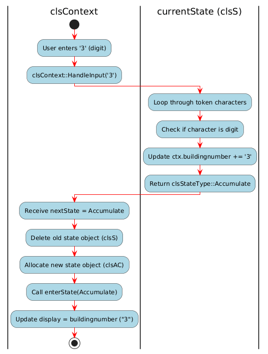

# FSM Moore Calculator Project

## Important Note
**Main.cpp** contains standalone test cases for validating the FSM calculator logic and is **not part of the DLL build**.

---

## Project Structure

```text
FSM_Moore_Calculator/
├── Core/
│   ├── Context/
│   │   ├── Context.h
│   │   └── Context.cpp
│   │
│   ├── States/
│   │   ├── Start.h
│   │   ├── Start.cpp
│   │   ├── AC.h
│   │   ├── AC.cpp
│   │   ├── OpWait.h
│   │   ├── OpWait.cpp
│   │   ├── Compute.h
│   │   ├── Compute.cpp
│   │   ├── Error.h
│   │   └── Error.cpp
│   │
│   └── FSM_Interface/
│   |   ├── AbstractClass.h
│   |   ├── AbstractClass.cpp
│   |   ├── StateType.h
│   |   └── StateType.cpp
│   |
│   └── Linkers/
│   |   ├── csFSMLinkercpp.h
│   |   └── csFSMLinlercpp.cpp
│   |
├── FSM_Calculator_GUI/
│   ├── calculatorbackend.cs
│   ├── CalculatorForm.cs
│   └── Program.cs
│   |
├── Main.cpp
├── MooreCalculatorMachine2.drawio.png
├── Transition State Occurence.png
└── README.md
```


# Moore FSM Calculator Project Documentation

## Project Overview
The **Moore FSM Calculator** is a software implementation of a finite state machine (FSM) designed to perform simple arithmetic calculations.  
This project simulates how a CPU control unit processes input using a **Moore machine approach**, where the outputs depend solely on the current state and not on the input.

The main idea is to take academic topics such as **finite state machines**, **polymorphism**, and **object-oriented programming** and convert them into a real-world software application.  
The calculator behaves according to well-defined states, transitions automatically, and produces the correct output for user input.

This project demonstrates the practical application of computer science concepts and shows how abstract theories can be translated into a working system that handles dynamic input while maintaining a clean and maintainable codebase.

---

## Idea and Academic Connection
In academic courses, finite state machines are often taught as diagrams on paper, focusing on **states, transitions, and outputs**.  
This project transforms that theory into a real software system:

1. Each state in the FSM is implemented as a separate class inheriting from a common abstract base class.
2. The context class manages the current state and performs transitions based on input.
3. User input is processed character by character, mimicking how real hardware interprets signals.

This demonstrates that concepts such as **Moore and Mealy machines**, state diagrams, and polymorphism are not just theoretical; they can be applied to create robust and extendable software systems.

---

## Object-Oriented Programming in the Project
The project uses **OOP principles extensively**:

- **Encapsulation:** Each state class (`clsS`, `clsAC`, `clsOpWait`, `clsCompute`, `clsError`) encapsulates the logic for handling input in that specific state.
- **Inheritance:** `clsAbstractClass` is a superclass for `clsS`, `clsAC`, `clsOpWait`, `clsCompute`, and `clsError`. These classes inherit from it.
- **Polymorphism:** `clsAbstractClass` provides a common interface (`HandleInput`) for all states. The `currentState` pointer in the context class calls the correct derived class method at runtime.
- **Abstraction:** Users and other parts of the code interact only with the `clsContext` class, without needing to know the internal workings of each state.
- **Modularity:** Each state class is independent and can be extended or modified without affecting others.

---

## Applying SOLID Principles
The project demonstrates several **SOLID design principles**:

- **Single Responsibility Principle (SRP):** Each state class has one responsibility — handling input for its state.
- **Open/Closed Principle (OCP):** New states or input types can be added by creating new classes without modifying existing ones.
- **Liskov Substitution Principle (LSP):** Each state can replace the abstract base class without breaking the system.
- **Interface Segregation Principle (ISP):** The abstract class only defines a single method (`HandleInput`), ensuring no unnecessary methods are forced on states.
- **Dependency Inversion Principle (DIP):** The context depends on the abstraction (`clsAbstractClass`) rather than concrete state implementations.

---

## Clean Code and Software Architecture
The project adheres to **clean code practices**:

- Clear class responsibilities and meaningful names (`clsContext`, `clsAC`, `clsCompute`).
- Consistent method names that describe their actions (`HandleInput`, `Transition`, `enterState`).
- Minimal global variables; all context data is encapsulated inside the `clsContext` object.
- Memory management is handled carefully, with dynamic allocation for state objects and deletion of previous states.

The architecture follows a **classic State Pattern**:

1. **Context:** Maintains state, handles input, executes transitions.
2. **State Classes:** Encapsulate state-specific behavior.
3. **State Enum:** `clsStateType` defines possible states clearly.

This design ensures the project is **maintainable, extendable, and professional**.

---

## States of the Calculator (State Diagram Overview)
The calculator operates in **five main states**:

1. **Start (`clsS`):** The initial state. Waits for the first digit or a sign (+/-) and builds the first number.
2. **Accumulate (`clsAC`):** Accumulates digits for the current number and handles operators or the equal sign.
3. **OperatorWait (`clsOpWait`):** Waits for the user to enter the next number after an operator.
4. **Compute (`clsCompute`):** Calculates the result when the equal sign is entered and prepares the system for the next operation.
5. **Error (`clsError`):** Handles invalid input and allows reset via 'C' or 'c'.

Each state class handles input differently and returns the **next state enum**, which the context uses to perform transitions.

---

## Detailed Explanation of `clsContext`
The `clsContext` class is the **core of the FSM**. It manages the current state, input, and transitions.

### Key Variables

- `clsAbstractClass* currentState` → Pointer to the active state object (points to derived classes like `clsS` or `clsAC`).  
- `buildingnumber` → Accumulates digits as the user types.  
- `operand1` → Stores the first operand for operations.  
- `lastnumber` → Stores the result of computations.  
- `operatorChar` → Stores the last operator entered.  
- `equal` → Tracks if the equal sign was entered.  
- `display` → Holds the string shown to the user.
---

## Moore Calculator Diagram:

### The Previous Diagram illustrates the Moore State Machine Calculator

## Key Methods

- **SetCurrentState(clsAbstractClass* newState)**  
  Updates the `currentState` pointer to a new state object.

- **HandleInput(string &token)**  
  Delegates the input to the current state via `currentState->HandleInput(token, *this)`.  
  Receives the next state enum and calls `Transition()`.

- **Transition(clsStateType nextState)**  
  Deletes the old state object, allocates a new one according to `nextState`, and calls `enterState()` to update the display.  
  This is where the FSM actually moves between states.

- **enterState(clsStateType next)**  
  Updates the display and resets or prepares context data depending on the state.  
  For example:  
  - In **Accumulate**, it shows the current number being typed.  
  - In **Compute**, it displays the last result.

- **compute(int a, char op, int b)**  
  Performs basic arithmetic based on the operator: addition, subtraction, multiplication, division.

- **getDisplay()**  
  Returns the current display string for GUI or console output.

## Pointer and Transition Logic

- `currentState` is a pointer to `clsAbstractClass`, but at runtime it points to a derived state object (polymorphism).
- The state object **never directly changes states**. It only returns a `clsStateType`.
- `clsContext` handles the actual transition:
  - Deletes the old object
  - Creates the new one
  - Updates the display
This design ensures clean separation of responsibilities and safe memory management.
---
## Tansition Activity Diagram:

# Activity Diagram Explanation:

The previous diagram illustrates how transitions occur within a finite state machine (FSM) in a calculator application.

## Scenario: Current State is `clsS`

### Step 0: Initial Setup
```cpp
clsContext ctx;
ctx.SetCurrentState(new clsS());  // Start state
```
- The `currentState` points to an instance of `clsS`.
- The `clsContext` data is initialized with default values:
  - `buildingnumber = ""`
  - `operand1 = 0`
  - `lastnumber = 0`
  - `operatorChar = '0'`

### Step 1: User Inputs a Number (e.g., "3")
```cpp
std::string token = "3";
ctx.HandleInput(token);
```
- Inside `clsContext::HandleInput`:
```cpp
type next = currentState->HandleInput(token, *this);
Transition(next);
```

### Step 2: Polymorphic Call to `clsS::HandleInput`
```cpp
type clsS::HandleInput(std::string Token, clsContext &ctx)
```
- Loop through the token (`'3'`):
  1. `'3'` is a digit → add to `buildingnumber`: 
     ```cpp
     ctx.buildingnumber += '3';
     ```
  2. Return the next state:
     ```cpp
     return clsStateType::Accumulate;
     ```
'this indicates that clsS does not perform the transition itself but requests it by returning an enum value.
'the transition request is handled separately.
'this design promotes separation of concerns and flexibility.
'these steps illustrate how input handling and state transitions are managed in this FSM-based calculator.

### Step 3: Transition Execution in `clsContext::Transition(next)`
```cpp
Transition(clsStateType::Accumulate);
 ```
to be executed inside the method

1) delete old state if exists:
```cpp
if(currentState) delete currentState;
```
2) Create the new state:
```cpp
case clsStateType::Accumulate: 
SetCurrentState(new clsAC());
```
3) Update display via enterState():
```cpp
enterState(nextState);   
display = buildingnumber.empty() ? "0" : buildingnumber;
```
## Transition is Completed 

## This project implements a Finite State Machine (FSM)-based calculator using a C++ DLL and a C# GUI. 
C++ DLL → contains the FSM calculator logic 
C# GUI → user interface that dynamically calls 
the DLL functions 
## This separation ensures modularity, memory safety and easy maintenance.

# C++ DLL Explanation

## Files
- **dllmain.cpp** → Standard Windows DLL entry point  
- **csFSMLinkercpp.h** → Declares exported functions for C#  
- **csFSMLinkercpp.cpp** → FSM calculator logic  

## Why DLL is Important
1. Allows the C++ FSM logic to be reused by C# GUI  
2. Keeps the GUI code simple and modular  
3. Supports memory management through explicit context creation/deletion  

## Build Instructions (C++ DLL)
1. Open `FSMCalculatorMachineDLL.sln` in Visual Studio  
2. Set **Configuration** → Release or Debug  
3. Set **Project Properties** → **Configuration Type** → Dynamic Library (.dll)  
4. Set **Target Architecture** → x64 (must match C# GUI)  
5. Build project → DLL is generated  
6. Copy the `.dll` into the C# GUI `bin` folder  

## Using the DLL in C# GUI

### CalculatorBackend Wrapper
Provides safe, object-oriented access to the DLL:

```csharp
CalculatorBackend backend = new CalculatorBackend();
backend.HandleInput("5");
backend.HandleInput("+");
backend.HandleInput("3");
string result = backend.CalculateResult(); // returns "8"
backend.Dispose();
```

## Architecture Matching

DLL and C# GUI must have the same architecture:

- **x64 ↔ x64**  
- **x86 ↔ x86**  

Set in **Project Properties → Build → Platform target**.  

Then you can run your GUI.

